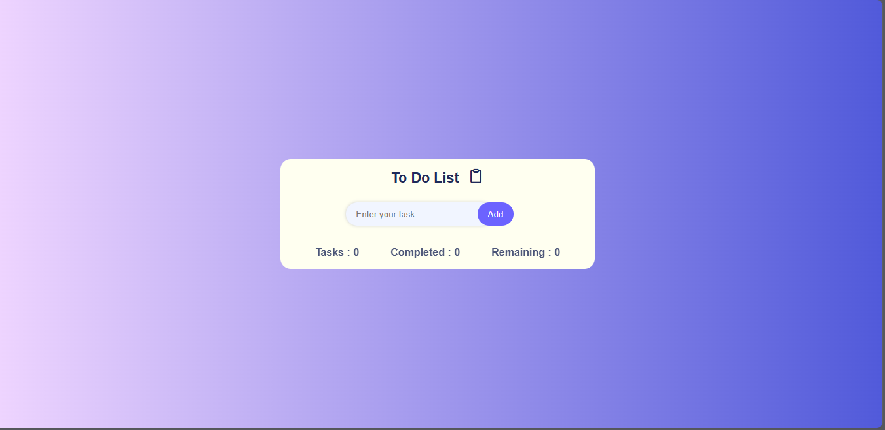
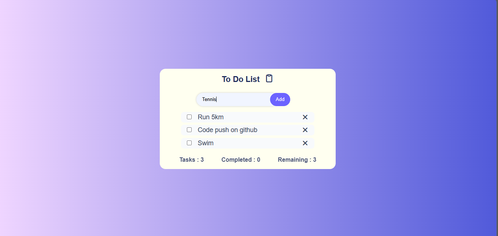
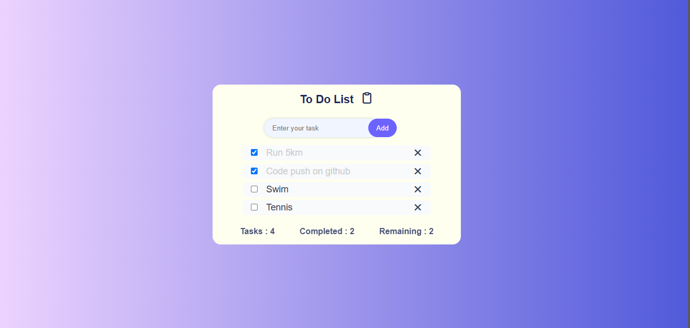
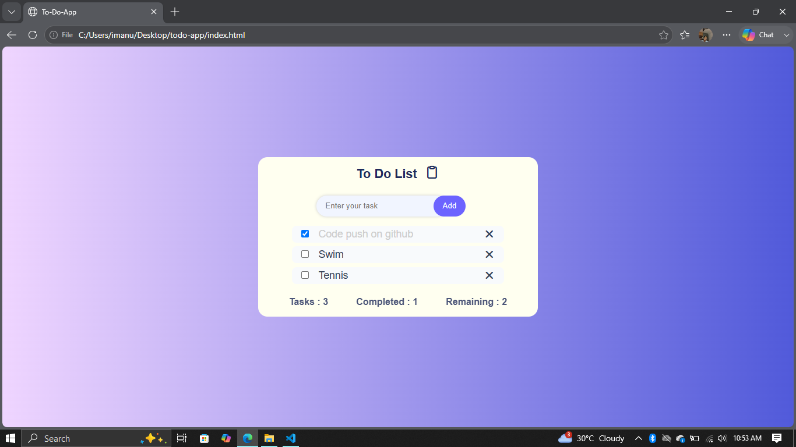

# 📝 To-Do App

A clean and responsive To-Do application built using **HTML**, **CSS**, and **Vanilla JavaScript**.

This project was built to practice JavaScript DOM manipulation, event handling, and dynamic UI updates.

---

## 🚀 Features

- ✅ Add new tasks
- 🗑️ Delete tasks
- ✨ Smooth fade and slide animations for tasks
- 📱 Responsive design
- 🎨 Clean and modern interface

---

## 🛠️ Technologies Used

- HTML5
- CSS3
- JavaScript (ES6)

---

## 📸 Screenshots

### Home



### Adding a Task



### Multiple Tasks



### After Deletion



---

## 📂 Project Structure

```
To-Do-App/
│
├── screenshots/
├── index.html
├── style.css
├── script.js
└── README.md
```

---

## 🎯 What I Learned

- DOM Manipulation
- Event Listeners
- Creating and Removing Elements
- CSS Animations
- Responsive Layouts
- Writing Cleaner JavaScript

---

## 🔮 Future Improvements

- 💾 Local Storage
- ✏️ Edit Tasks
- 🌙 Dark Mode

---

## ▶️ How to Run

1. Clone this repository

```bash
git clone https://github.com/ianushkka/To-Do-App.git
```

2. Open `index.html` in your browser.

---

## 👩‍💻 Author

**Anushka Tripathi**

Built as part of my JavaScript learning journey.